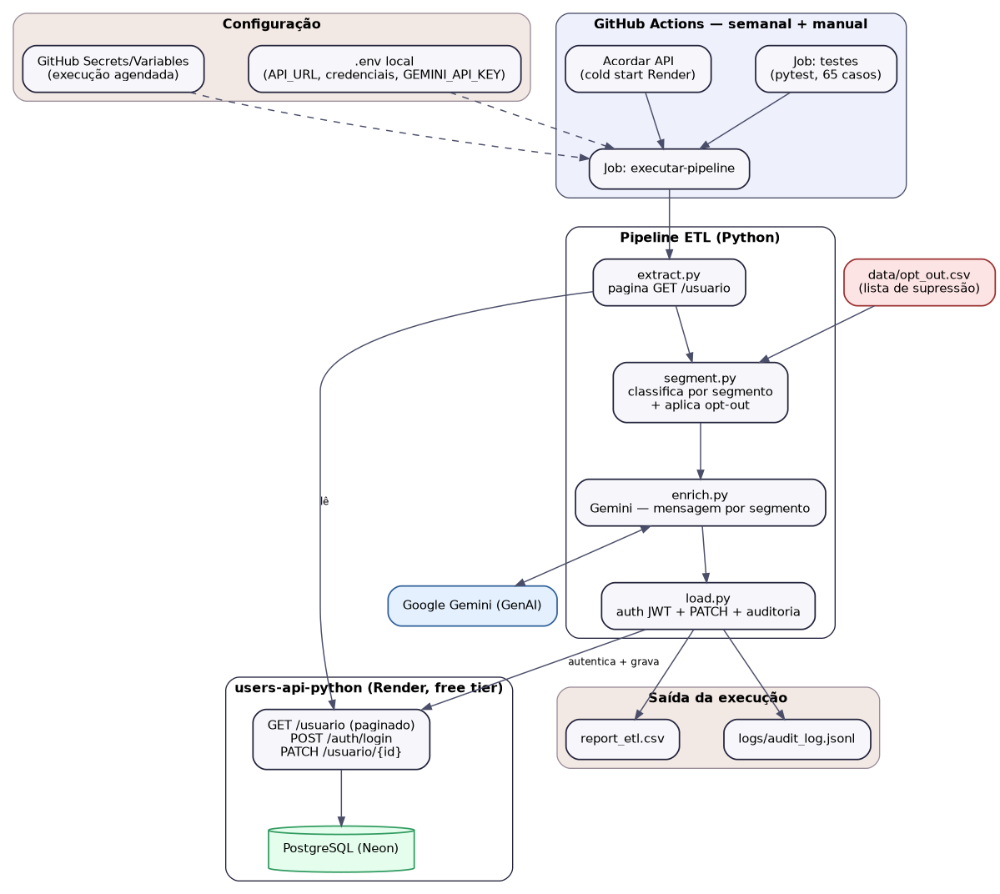
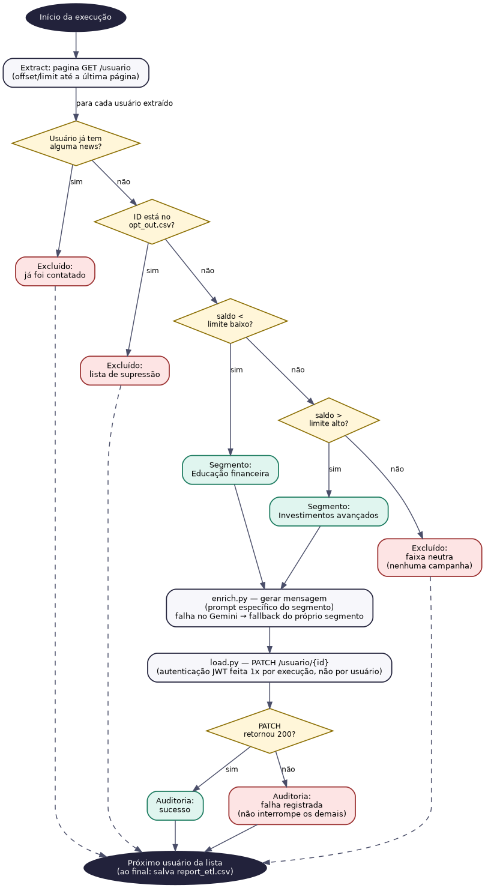

# Pipeline ETL de campanha financeira segmentada

Esse projeto nasceu como o desafio "Explorando IA Generativa em um Pipeline de ETL com Python", do Bootcamp Santander 2025. Comecei com um script único que lia 4 IDs fixos de um CSV, buscava cada usuário numa API, gerava uma mensagem com o Gemini e gravava de volta. Funcionava, mas era basicamente um exercício — ninguém em produção fica editando um arquivo com 4 IDs toda vez que quer rodar uma campanha.

Reescrevi do zero pensando em como isso funcionaria de verdade num banco: em vez de receber uma lista pronta de quem processar, o pipeline decide sozinho quem entra na campanha, a partir de uma regra de negócio aplicada sobre a base inteira.

## O que ele faz

A regra que implementei: clientes com saldo baixo (inclusive negativo) entram numa campanha de educação financeira; clientes com saldo alto entram numa campanha de investimentos avançados; quem está no meio dos dois limites não é público de nenhuma das duas. Quem já recebeu qualquer comunicação da campanha, ou está numa lista de supressão (opt-out), é excluído independente do saldo.

Cada elegível recebe uma mensagem gerada pelo Gemini, com um prompt diferente dependendo do segmento — e se o Gemini falhar por qualquer motivo (rate limit, timeout, erro de rede), cai num fallback também específico do segmento, não um texto genérico. A ideia é que uma falha pontual na IA não bagunce a mensagem que o cliente recebe.

No final, cada tentativa de gravação é registrada num log de auditoria (quem, quando, qual segmento, qual mensagem, se deu certo) e um relatório CSV acumula um resumo por execução.

## Por que a lista de supressão virou o dado de entrada, e não os IDs

Essa foi a mudança mais importante da reescrita. Um CSV com IDs fixos representa "quem processar", e isso não escala nem faz sentido operacionalmente. Uma lista de opt-out representa "quem excluir" — é o padrão real que qualquer área de marketing/compliance usa, e o pipeline continua decidindo a audiência sozinho a partir da base inteira da API.

## A limitação que decidi não fingir que não existe

Eu queria que a regra de segmentação considerasse recência — por exemplo, "só contatar quem não recebeu nada nos últimos 30 dias". O modelo de dados da API que uso como fonte (`users-api-python`, outro projeto meu) não guarda data nenhuma nas news, só se existe ou não. Dava pra eu inventar uma data fake só pra fechar a regra bonita, mas preferi ser honesto sobre o que o dado real permite: hoje a regra é "nunca recebeu nenhuma comunicação", não "não recebeu recentemente". Se um dia eu adicionar um campo de data no modelo da API, essa regra evolui — mas isso é trabalho futuro, não uma correção de bug.

## Arquitetura

<div align="center">
  
</div>

<div align="center">
  
</div>

O pipeline é dividido em módulos que não sabem uns dos outros além do necessário:

- `extract.py` — busca a base inteira na API, paginando (a API não devolve contagem total, então a única forma confiável de saber que a paginação acabou é quando uma página vem menor que o limite pedido)
- `segment.py` — a única parte com lógica de negócio de verdade; recebe a base e a lista de supressão, devolve quem é elegível pra cada campanha
- `enrich.py` — gera a mensagem via Gemini, com prompt e fallback por segmento
- `load.py` — autentica na API (JWT), grava via PATCH (não PUT — o endpoint de update completo exige o objeto inteiro, e eu só preciso mexer na news) e escreve o log de auditoria
- `settings.py` — toda configuração centralizada, carregada uma vez; nenhum outro módulo lê variável de ambiente diretamente
- `main.py` — só orquestra a ordem, sem lógica própria

Separei assim porque quero conseguir testar a regra de segmentação sem precisar de rede, sem precisar de banco, sem precisar do Gemini — e hoje isso é literalmente possível: `segment.py` roda isolado com uma lista de dicionários em memória.

## Projeto relacionado

A fonte e o destino dos dados é a **users-api-python** — API que também construí, com FastAPI, SQLModel e Postgres (Neon). Os dois projetos formam um ecossistema: a API expõe os dados, o ETL decide o que fazer com eles.

Um detalhe de infraestrutura que vale registrar: originalmente hospedava a API no Railway, mas o plano gratuito deles mudou de modelo em 2026 (virou trial + US$1/mês) e o deploy parou. Migrei para a Render, que tem um free tier real sem cartão de crédito — a troca é que o serviço "dorme" depois de 15 minutos sem uso, e a primeira requisição depois disso demora uns 30-60 segundos pra acordar. Pra portfólio isso é aceitável; pra produção de verdade, não seria — e essa é exatamente a diferença que eu explicaria numa entrevista se perguntassem.

🔗 [users-api-python](https://github.com/matheusguimaraesdata/users-api-python)

## Rodando localmente

```bash
git clone https://github.com/matheusguimaraesdata/projeto_etl_com_ia_santander_bootcamp.git
cd projeto_etl_com_ia_santander_bootcamp
pip install -r requirements.txt
```

Crie um `.env` na raiz:

```
API_URL=https://sua-api.onrender.com
API_USERNAME=usuario_admin
API_PASSWORD=sua_senha
GEMINI_API_KEY=sua_chave_aqui
SALDO_LIMITE_BAIXO=1000
SALDO_LIMITE_ALTO=20000
```

Os testes não tocam rede nenhuma (tudo mockado), então rodam sem `.env`:

```bash
pytest -v
```

Pra rodar o pipeline de verdade, é preciso estar dentro de `src/` — os módulos se importam entre si de forma direta (`import extract`), não como pacote:

```bash
cd src
python main.py
```

## Stack

<div align="center">

[](https://skillicons.dev)

<p>
  
  
  
  
</p>
</div>

## O que eu aprendi fazendo isso

Ainda vou escrever essa parte com calma — foi bastante coisa: a decisão de trocar PUT por PATCH depois de ler a documentação da própria API e perceber que ia sobrescrever dado que não deveria tocar; o processo de migrar de Railway pra Render no meio do projeto; e principalmente entender, na prática, que "não fingir que uma limitação de dado não existe" (o caso da falta de data nas news) é uma decisão de engenharia tão válida quanto qualquer outra — só que mais honesta.

## Autor

**Matheus Guimarães**
Analista de Dados Júnior | Python, SQL, ETL & Automação

[LinkedIn](https://www.linkedin.com/in/matheusguimaraesdata/) · [GitHub](https://github.com/matheusguimaraesdata/)